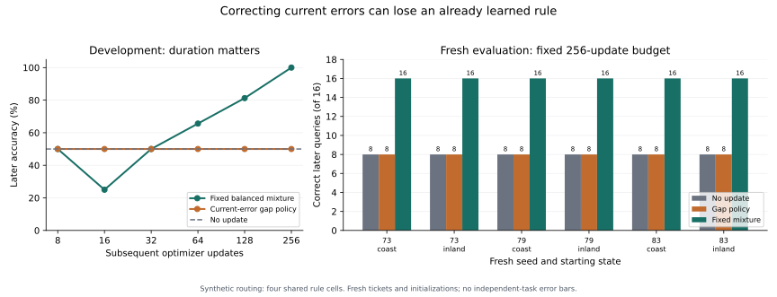

# Selecting correct experience under partial acquisition

Follow-up to the accepted [first-phase findings](FINDINGS.md).
The first-phase publication, protocols and evidence remain preserved.

## Result

At the prospectively fixed **256-update budget**, a fixed balanced
mixture scored **96/96** on fresh later queries. Selecting only the
region with more current errors scored **48/96**; no update scored
**48/96**. Both source pools contain correct observations. This
comparison concerns choosing experience by present errors, not estimating source
truthfulness or implementing a general adaptive selector.

The gap policy repaired the missing region and lost the previously learned region
in **6/6 states**. Correctly identifying an error did not
identify a useful isolated update for the balanced later workload. The mixture
spends half its updates on each region, including observations the learner already
answers correctly. Source composition matters here; the tested adaptive choice
adds no accuracy beyond abstention or either fixed pure source.

## Workload and information access

Two regions, coast and inland, have opposite correct mappings from copper/violet
channels to heron/otter destinations. A random ticket is irrelevant. The request
names its region; evaluation asks for only the destination. These are four rule
cells in a synthetic routing component, not four independent real-world tasks.

For each run, eight checked training observations cover two tickets and all four
cells. Four additional labeled probes use one disjoint ticket. Sixteen later
queries use four further disjoint tickets. Both controls and selector can access
the same eight training labels, four verification labels, and pre-update probe
answers. Probe tickets are used only for checking, never secretly added to an
update. The context reference receives all twelve labeled observations in every
prompt. Obtaining labels is privileged synthetic supervision; real verification
costs were not measured.

The same sixteen later queries are used across both starting states within each
run, giving 48 distinct later requests and 96 state/query outcomes
for each source policy in the fresh cohort.

Two states are constructed independently from the same base initialization using
64 updates on one region. Each source branch starts from the exact same saved
partial-state weights, with a fresh optimizer. The sources are coast, inland,
and a fixed 50:50 mixture. Mixture updates alternate coast then inland, using the
same shuffled within-region orders as the pure sources. All targets are correct.
The same answer-only cross entropy including EOS is used throughout.

The diagnostic gap policy uses four labeled probes: abstain if none is wrong,
choose the region with more errors otherwise, and choose the mixture on a tie.
This rule is fixed before candidate training. It is not claimed to be the best
possible adaptive policy. Outcomes for the chosen branch are read from the paired
candidate experiment; deploying the policy requires only its chosen branch, not
all the counterfactual training used to measure source utility.

## Development and bounded diagnosis

Exploratory seed 71 first tested 8, 16, 32 and 64 updates. Both exposed regions
were acquired 8/8 at state construction. Gap-only updates eventually learned the
other region 8/8 while reducing the previously learned region to 0/8. The mixture
had not acquired both rules at 64 steps. We extended the identical trajectories
to 128 and 256, and added mixture training from base to test joint learnability.
No development failures or intermediate checkpoints were removed.

| Development | Updates per branch | Fixed coast | Fixed inland | Fixed mixture | Gap policy |
|---|---:|---:|---:|---:|---:|
| v1 | 8 | 16/32 | 16/32 | 16/32 | 16/32 |
| v1 | 16 | 16/32 | 16/32 | 8/32 | 16/32 |
| v1 | 32 | 16/32 | 16/32 | 16/32 | 16/32 |
| v1 | 64 | 16/32 | 16/32 | 21/32 | 16/32 |
| v2 | 64 | 16/32 | 16/32 | 21/32 | 16/32 |
| v2 | 128 | 16/32 | 16/32 | 26/32 | 16/32 |
| v2 | 256 | 16/32 | 16/32 | 32/32 | 16/32 |

Joint mixture acquisition from base: 64 updates → 8/16, 128 updates → 12/16, 256 updates → 16/16.

The fixed source, primary duration and shorter diagnostic checkpoints were chosen
on development and committed in [the fresh protocol](protocol/followup-fresh-v1.md)
before generating or evaluating fresh cases. V2 and v1 share exact checkpoint
files and update prefixes, checked by [the repeat audit](evidence/followup-repeat-audit/audit.json).

## Fresh comparison

All 3 prespecified initialization/data seeds are included. No fresh
checkpoint is promoted after seeing its score. Each row below is a complete
balanced evaluation across the two states and all fresh runs.

| Updates per branch | Fixed coast | Fixed inland | Fixed mixture | Gap policy |
|---:|---:|---:|---:|---:|
| 128 (diagnostic) | 48/96 | 48/96 | 82/96 | 48/96 |
| 256 (primary) | 48/96 | 48/96 | 96/96 | 48/96 |

No update: 48/96. All-evidence context at partial states:
44/96. Base with all evidence: 36/48.
The context reference is one fixed prompt, not an optimized retrieval system;
these results do not establish a general advantage of storing knowledge in weights.

### Component outcomes at the primary duration

Each entry is **coast correct / inland correct**, out of 8 per region. The state
name indicates which source constructed it, not an assumption about acquisition.

| Seed | State | No update | Coast source | Inland source | Mixture | Policy choice |
|---:|---|---|---|---|---|---|
| 73 | coast | 8 / 0 | 8 / 0 | 0 / 8 | 8 / 8 | inland |
| 73 | inland | 0 / 8 | 8 / 0 | 0 / 8 | 8 / 8 | coast |
| 79 | coast | 8 / 0 | 8 / 0 | 0 / 8 | 8 / 8 | inland |
| 79 | inland | 0 / 8 | 8 / 0 | 0 / 8 | 8 / 8 | coast |
| 83 | coast | 8 / 0 | 8 / 0 | 0 / 8 | 8 / 8 | inland |
| 83 | inland | 0 / 8 | 8 / 0 | 0 / 8 | 8 / 8 | coast |

6/6 constructed states meet the exposed-region acquisition criterion. The mixture strictly exceeds the gap policy in 6/6 states. The policy abstains in 0/6 states; its update totals below make any savings explicit.

The shorter fixed-mixture comparator scores 82/96 at 128 updates. These outcomes are reported without changing the primary checkpoint. The selected primary duration is not claimed to be globally minimal.

## Costs and audit

The 6 partial-state constructions cost **384 updates**.
Subsequent fixed-mixture training costs **1536 updates**, versus
**1536** for the gap policy. Totals including construction are
**1920** and **1920** respectively.
No-update and context arms cost no subsequent updates. State construction is a
workload intervention and is charged explicitly; it is not free pretraining.

The policy makes **24 verification generations**, totaling
**1284 prompt plus completion tokens**. Controls have equal
access to those results in the paired experiment. A fixed policy could omit the
verification calls when deployed; no verification saving is credited to selection.
The source pools have equal numbers of observations and the output targets have
the same objective; update counts are matched, while exact token costs are reported
below. Token counts are not FLOPs.

| Primary arm | Subsequent training input tokens | Target tokens | Later prompt tokens | Later completion tokens |
|---|---:|---:|---:|---:|
| coast | 80896 | 4608 | 4856 | 288 |
| inland | 79360 | 4608 | 4856 | 288 |
| mixture | 80128 | 4608 | 4856 | 288 |
| selected | 80128 | 4608 | 4856 | 288 |

The mixture and gap policy also match in aggregate training input tokens; the composition contrast is not explained by more gradient updates or more total input tokens.

Actually running every fresh counterfactual and diagnostic cost 4992 optimizer
updates and 1896 recorded scoring generations, plus
60 exact-token reload generations.
Fresh run timers sum to 1095.54 seconds; timings describe observed execution,
not isolated-hardware latency. [Resource notes](notes/resource-use.md) record
shared-device coordination. The local host is a 64 GiB M1 Ultra.

The [audited metrics](evidence/followup-fresh-v1-audit/metrics.json) link all raw runs. The audit checks file
hashes, prompt/token decoding, independent score reconstruction, disjoint tickets,
source orders, matched starting hashes, finite gradients with nonzero updates,
decisions before candidate training, frozen-base invariants and exact token replay
after checkpoint reload (one saved generation per evaluated checkpoint). All
evaluated adapters, script snapshots and raw records
are preserved. See [reproduction](notes/followup-reproduction.md).

## Interpretation and limits

Present prediction errors measure a remaining gap, but do not measure the total
utility of training only on that gap. An already-correct experience can still
matter when another update would disrupt its behavior. Per-region scores and the
joint-mixture acquisition control distinguish this from failure to learn the
new component or impossibility of representing both rules. Training loss alone
does not identify balanced downstream utility.

For example, in development's coast state at 256 updates, the mean loss over the
last eight gap-source updates was 0.00000707 with 8/16 later accuracy; the mixture's
mean was 0.0232 with 16/16 later accuracy. These losses describe their respective
training pools, with correct labels and matched objectives, rather than a common
measure of downstream success.

This study tests a single source decision followed by a fixed update schedule,
not repeated online reselection, learned mixture ratios, or prediction of update
damage. There are only two correct pools, four rule cells, one model/objective,
and a balanced query distribution. Fresh tickets and initializations test local
reproducibility; the 96 query outcomes are not 96 independent task draws. No
general statistical or real-agent performance claim follows from these counts.

Rehearsal and interference-aware selection are established methods. [CLEAR](sources/followup-rehearsal/README.md)
mixes new and replayed experience with RL-specific objectives; [MIR](sources/followup-rehearsal/README.md)
selects replay by predicted loss increases after a virtual update. Neither method
is implemented here. The finding concerns the sufficiency of a simple fixed
mixture and the limitation of current-error targeting on this workload, not the
novelty of rehearsal or a universal failure of selection.

## Provenance

Runtime reused unchanged from this study's accepted publication
`dca27dd46b634616e8895e0a137f23225c5dc7cc`. Qwen/Qwen3-4B-Instruct-2507 revision
`cdbee75f17c01a7cc42f958dc650907174af0554`; MLX-LM revision
`86b48c461feebf87c58788655b7e57b5574b9e6d`, MLX 0.32.2, exact environment in
`uv.lock` and each run's resource.json. Native LoRA rank 8, scale 2, q/v projections
in the final eight layers, no dropout; AdamW learning rate .0005, no weight decay,
batch one. No teacher-distribution access is used or claimed.

Original primary methods and transitive code provenance are in
[sources/README.md](sources/README.md); additional proceedings versions and hashes
are in [rehearsal sources](sources/followup-rehearsal/README.md).
The [development log](notes/followup-development.md) preserves changes and diagnosis.

