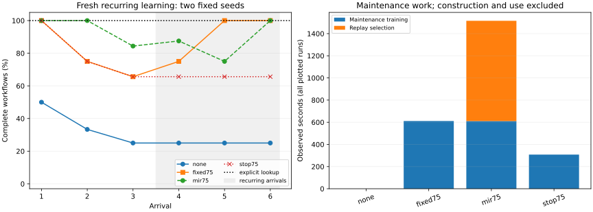

# Maintaining complete workflows through recurring learning

Third-phase findings for [experience selection](README.md). Both earlier publications remain preserved.

## Result

Across two prospectively fixed fresh runs, a development-tuned fixed mixture completed **143/168** post-arrival workflows. Damage-aware replay completed **151/168** at the same actual update and target-token budgets. Both used 75% replay. The fixed stopping schedule completed **118/168** with half as many maintenance updates. The explicit archive reference completed **168/168** with no learning updates.

Damage-aware replay completed eight more uses overall, but its advantage was concentrated in acquisition: 67/72 versus 55/72. During recurrence it completed fewer uses, 84/96 versus 88/96, and it added 192 virtual updates and 6,144 scoring forwards. This is a measured accuracy–work tradeoff in two runs, not evidence of a general maintenance or compute advantage.

The stopping control uses a fixed schedule regardless of whether acquisition succeeded. Its accuracy and smaller update count must be considered together; fewer updates alone are not a useful-cost advantage.

## Fresh complete-task outcomes

| Policy | Acquisition prefix | Recurring suffix | All uses | Final | Lost before/after outcomes |
|---|---:|---:|---:|---:|---:|
| No maintenance | 24/72 | 24/96 | 48/168 | 8/32 | 0 |
| Fixed 75% replay | 55/72 | 88/96 | 143/168 | 32/32 | 9 |
| Damage-aware 75% replay | 67/72 | 84/96 | 151/168 | 32/32 | 11 |
| Fixed replay, then stop | 55/72 | 63/96 | 118/168 | 21/32 | 6 |
| Explicit archive | 72/72 | 96/96 | 168/168 | 32/32 | — |

The sequence introduces birch, cedar and dune after an acquired alder state, then repeats those three arrivals. Every arrival scores all seen sites. The 168 outcomes contain repeated uses of **32 distinct later-ticket requests**, eight rule cells and two initializations. They are not 168 independent task draws. Freshness concerns new tickets and initializations under unchanged rules.

| Seed | Initial alder acquisition | No maintenance final | Fixed final | Damage-aware final | Stop final |
|---|---:|---:|---:|---:|---:|
| 103 | 4/4 | 4/16 | 16/16 | 16/16 | 16/16 |
| 107 | 4/4 | 4/16 | 16/16 | 16/16 | 5/16 |

### Where the fresh policies differ

Seed 103 completed every use under fixed replay, damage-aware replay and stopping. All differences between these three policies came from seed 107, which changed both initialization and tickets; this experiment does not separate those two sources of variation.

| Seed 107 policy | Arrival 1 | Arrival 2 | Arrival 3 | Arrival 4 | Arrival 5 | Arrival 6 |
|---|---:|---:|---:|---:|---:|---:|
| Fixed 75% replay | 8/8 | 6/12 | 5/16 | 8/16 | 16/16 | 16/16 |
| Damage-aware 75% replay | 8/8 | 12/12 | 11/16 | 12/16 | 8/16 | 16/16 |
| Fixed replay, then stop | 8/8 | 6/12 | 5/16 | 5/16 | 5/16 | 5/16 |

The stop intervention shares exactly the fixed policy’s first three checkpoints, then preserves that third checkpoint byte-for-byte. In seed 103 it preserves 16/16 behavior; in seed 107 it preserves only 5/16 while continued fixed replay recovers to 16/16. Thus seeing every rule is insufficient evidence that maintenance is redundant. Preserving complete behavior while saving updates is conditional on the state already acquired, and the fixed schedule does not establish that condition.

Damage-aware replay also fails to preserve all learned behavior: seed 107 falls from 12/16 to 8/16 at arrival 5 while fixed replay rises from 8/16 to 16/16. Across the cohort, damage-aware replay has 11 before/after losses versus nine for fixed replay. These losses are measured relative to each policy’s own evolving state, not identical counterfactual starting points at later arrivals. The experiment tests the full policies; it does not identify the individual causal value of a ranked record.

| Policy | Eligible resource | Correct preparation | Complete state |
|---|---:|---:|---:|
| No maintenance | 88/168 | 96/168 | 48/168 |
| Fixed 75% replay | 154/168 | 148/168 | 143/168 |
| Damage-aware 75% replay | 152/168 | 164/168 | 151/168 |
| Fixed replay, then stop | 136/168 | 130/168 | 118/168 |

The selector’s higher complete count accompanies better preparation accuracy, despite slightly lower resource accuracy than fixed replay. Component improvements cannot substitute for joint success.

## Workload and access

A dispatch requires three ordered actions: reserve an eligible resource, perform its required preparation, and ship. Success requires the complete resulting inventory, preparation, cleared reservation and shipment state, with no invalid action. Resource and preparation scores diagnose errors but never replace complete success. Actions are scoped to the current parcel; ticket copying is not required. Each dispatch starts with its own full inventory, so the experiment measures state changes within jobs rather than one persistent inventory across jobs.

There are four sites and two parcel kinds, eight rule cells and four valid action traces. Sixteen checked training tickets cover each cell; two disjoint later tickets per cell are scored in each fresh run. All historical rules remain correct. This is a small structured sandbox, not broad real-agent workflow generalization.

Each learned policy starts from the same alder-only adapter constructed with 128 updates. The calibration adapter that learned all sites is not reused. Optimizers reset each arrival; later weights diverge as consequences of policy history. Targets, loss and initial states are matched. Every target has five tokens including EOS; exact prompt-token differences remain in the cost table.

The selector ranks a sample of up to 16 old archive records by target-loss increase after one virtual incoming AdamW step, using cloned current optimizer moments. It reselects every 16 actual updates and cycles through the top half of candidates on replay slots. Exact restoration, optimizer isolation and equality between the virtual step and next real incoming step are checked. This adapts [MIR](sources/maintenance-mir/README.md); it is not a replication of the original image-classifier implementation.

All policies can access the same checked archive and paired verification results. The selector uses archive labels, not later-case scores, to choose replay. The explicit reference retrieves a successful trace by the structured site/kind key and executes it through the identical sandbox. It receives no future-site rows before arrival. The key schema and the ticket’s irrelevance are designed knowledge. Labels and the checker are privileged synthetic supervision; real annotation and verification costs were not measured.

## Development and diagnosis

Initial training with two tickets per cell memorized 16/16 examples at 512 updates but completed only 3/8 unseen-ticket workflows. Increasing diversity to sixteen tickets per cell yielded 4/8 at 512 updates and **8/8 at 1,024**, with 128/128 training success. This establishes a functioning acquisition regime; it does not prove that diversity is necessary at the longer duration. Failed attempts are preserved.

At 128 maintenance updates per arrival, incoming-only learned each new site and lost the previous one. The best fixed mixture (75% replay) completed 16/18 uses, whereas damage-aware 50% replay completed 7/18. We then tested a longer duration and matched replay fraction before making fresh claims.

| Development updates per arrival | Fixed 25% | Fixed 50% | Fixed 75% | Damage-aware 50% | Damage-aware 75% |
|---:|---:|---:|---:|---:|---:|
| 128 | 7/18 | 10/18 | 16/18 | 7/18 | — |
| 256 | — | — | 18/18 | 17/18 | 18/18 |

The longer, matched-fraction comparison resolves the initial selector floor: this implementation can maintain complete development behavior. It also shows that a fixed mixture suffices. The strongest tested selector, fixed comparator, 256-update duration, stopping control, two seeds and six-arrival sequence were committed in [the fresh protocol](protocol/maintenance-fresh-v1.md) at `ba91a06` before any fresh case generation. All seeds and checkpoints are retained; fresh outcomes did not select a replacement policy.

## Costs

Costs below sum the two fresh scenarios for one deployed policy. Each learned policy additionally pays **256 construction updates**. Construction was executed once per seed in the paired experiment. Before-update generations and checkpoint replay are research diagnostics; neither fixed policies nor the MIR loss scorer need those generation calls when deployed.

| Policy | Maintenance updates | Virtual updates | Labeled scoring forwards | Training input / target tokens | Inclusive selection seconds | Training seconds |
|---|---:|---:|---:|---:|---:|---:|
| No maintenance | 0 | 0 | 0 | 0 / 0 | 0.00 | 0.00 |
| Fixed 75% replay | 3072 | 0 | 0 | 302086 / 15360 | 0.00 | 611.22 |
| Damage-aware 75% replay | 3072 | 192 | 6144 | 302182 / 15360 | 905.16 | 610.62 |
| Fixed replay, then stop | 1536 | 0 | 0 | 151078 / 7680 | 0.00 | 307.88 |

| Policy | Later prompt / output tokens | Later generation seconds |
|---|---:|---:|
| No maintenance | 15825 / 840 | 37.64 |
| Fixed 75% replay | 15825 / 840 | 38.67 |
| Damage-aware 75% replay | 15825 / 840 | 38.99 |
| Fixed replay, then stop | 15825 / 840 | 38.26 |

| Policy | Before-update verification calls | Prompt / output tokens | Generation seconds |
|---|---:|---:|---:|
| No maintenance | 168 | 15825 / 840 | 37.64 |
| Fixed 75% replay | 168 | 15825 / 840 | 37.68 |
| Damage-aware 75% replay | 168 | 15825 / 840 | 37.76 |
| Fixed replay, then stop | 168 | 15825 / 840 | 37.75 |

The common starting-state construction uses 25200 input tokens and 1280 target tokens in 50.27 training seconds across both seeds. Verification calls above are separately charged research diagnostics; costs of initial-state evaluation and checkpoint reload generation are retained in the raw run records and whole-run timers.

Damage-aware scoring additionally processes 604352 input tokens and 30720 labeled target tokens; its virtual updates process 18880 / 960. These are distinct from actual training. Whole-selection time includes cloning, hashing, virtual training, scoring, ranking and restoration, so component timings must not be added again. Token counts are not FLOPs.

The explicit reference stores 256 checked records across the two scenarios, with [11616, 11616] serialized archive bytes per run. It performs 700 lookup comparisons and emits 672 action tokens. Measured in-memory lookup plus execution totals 0.000565 seconds; archive construction totals 0.001404 seconds. Those timings exclude persistent-disk access, Python object overhead and real annotation. A saved adapter is 2624893 bytes, in addition to the common foundation model.

Actually executing all counterfactual branches and virtual updates costs **8128 optimizer steps**, plus diagnostics, replay checks and generation. Fresh run timers sum to **2929.27 seconds**, with peak MLX allocation **9619995688 bytes**. [Resource notes](notes/resource-use.md) record shared-device coordination; these are observed timings, not isolated-hardware latency or a general amortization claim.

## Interpretation and limits

The study separates complete acquisition, repeated use and maintenance. End-of-sequence success alone would hide failures during the acquisition prefix. Correct archive records can remain useful rehearsal, but selecting records with predicted loss increases is not automatically more useful than a tuned fixed mixture. The stopping intervention shows that unchanged rules alone do not justify abstention: a state that has not acquired them still benefits from recurring training.

The explicit reference demonstrates the strength of an accessible, sufficient structured archive in this sandbox. It does not establish a universal choice between weights and retrieval. Likewise, the comparison does not test novel-rule generalization, changing historical rules, a learned abstention gate, optimized batched MIR implementations, long-horizon agent behavior or globally minimal training budgets.

## Evidence and reproduction

The [aggregate metrics](evidence/maintenance-fresh-v1-cohort/metrics.json) link to [per-run audited metrics](evidence/maintenance-fresh-v1-audit/metrics.json). Raw runs preserve prompts, token IDs, state outcomes, every update and selection, evaluated adapters, exact reload checks, source snapshots and manifests. The auditor checks historical-only candidate access, complete evaluation membership, matched starts, frozen-prefix checkpoint equality, disjoint development/fresh tickets and byte-identical policy/protocol snapshots against `ba91a06`.

[Methods](notes/maintenance-methods.md), [development log](notes/maintenance-development.md), [reproduction](notes/maintenance-reproduction.md), and [primary implementation provenance](sources/maintenance-mir/README.md) provide the full specification. Qwen3-4B-Instruct-2507 revision `cdbee75f17c01a7cc42f958dc650907174af0554`; MLX-LM revision `86b48c461feebf87c58788655b7e57b5574b9e6d`; exact environment in `uv.lock` and run resource records. No teacher distributions are used.
